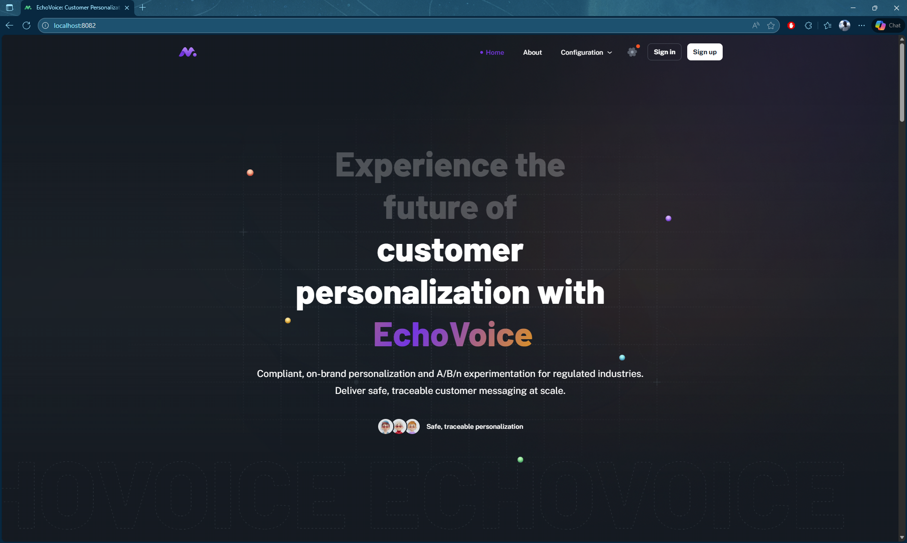
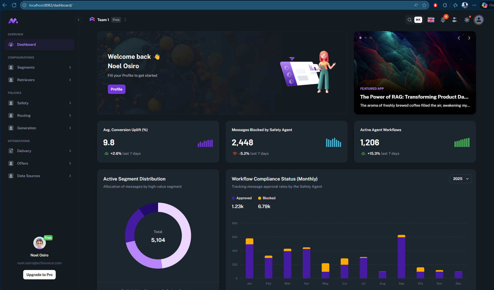
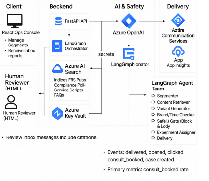

# 🚀 **EchoVoice: Customer Personalization Orchestrator**

**Project Title:** `EchoVoice: Customer Personalization Orchestrator`
**Challenge Solved:** *Compliant, on-brand personalization and A/B/n experimentation in a regulated domain.*

EchoVoice is a **multi-agent AI personalization platform** designed for regulated industries. It delivers safe, on-brand, traceable customer messaging through a coordinated set of specialized agents working together inside a transparent and auditable orchestration pipeline.

This repository provides a **prototype scaffold** for local development — including a LangGraph-based orchestrator, agent suite, mock retrieval (text-target) data, and a frontend stub for auditability.

EchoVoice is built to demonstrate how modern enterprises can combine **retrieval, guardrails, multi-agent orchestration, audit trails, and compliance automation** to deliver personalization safely at scale.

---
## ⭐ Why EchoVoice?

From the Gamma deck:

> **“AI personalization is powerful — but unsafe when uncontrolled.”**
> AI models hallucinate, violate regulation, drift off-brand, or generate misleading claims.
> This prototype shows how to **control** AI-powered personalization through enforcement architecture.

EchoVoice solves four major industry problems:

1. **Regulatory risk** — customers must never receive false, unapproved, non-compliant messaging.
2. **Brand drift & inconsistency** — large models generate tone-unsafe or off-brand copy.
3. **Lack of traceability** — compliance teams require citations, evidence, logs, and overrides.
4. **Experimentation bottlenecks** — brands need fast A/B/n testing but with safety guarantees.

EchoVoice addresses all four using a structured, multi-agent LangGraph design.

---

## 🧠 How EchoVoice Works (High-Level)

EchoVoice implements a **4-phase closed-loop orchestration pipeline**, with agents collaborating to generate, inspect, correct, and approve personalized messages:

1. **Segmentation →** Pick best segment for the user’s goal.
2. **Retrieval →** Pull grounded facts from product knowledge.
3. **Generation + Compliance →** Produce message variants and enforce safety.
4. **Experimentation + Feedback →** Score variants, pick winner, close the loop.

Each phase is implemented as an independent LangGraph, all connected in a master orchestrator.

---
## Table of Contents

- [🚀 **EchoVoice: Customer Personalization Orchestrator**](#-echovoice-customer-personalization-orchestrator)
  - [Table of Contents](#table-of-contents)
  - [Features](#features)
    - [Architecture Diagram](#architecture-diagram)
  - [🚀 The End-to-End LangGraph Architecture](#-the-end-to-end-langgraph-architecture)
    - [Phase 1: Segmentation (Decision \& Context)](#phase-1-segmentation-decision--context)
    - [Phase 2: Content Retrieval (Grounded Facts)](#phase-2-content-retrieval-grounded-facts)
    - [Phase 3: Generation and Compliance (Safety Barrier)](#phase-3-generation-and-compliance-safety-barrier)
    - [Phase 4: Experimentation and Feedback (Closing the Loop)](#phase-4-experimentation-and-feedback-closing-the-loop)
  - [Azure account requirements](#azure-account-requirements)
    - [Cost estimation](#cost-estimation)
  - [Getting Started](#getting-started)
    - [GitHub Codespaces](#github-codespaces)
    - [VS Code Dev Containers](#vs-code-dev-containers)
    - [Local environment](#local-environment)
  - [Deploying](#deploying)
  - [Running the development server](#running-the-development-server)
  - [Using the app](#using-the-app)
  - [Clean up](#clean-up)
  - [Guidance](#guidance)




[📺 Watch a video overview of the app.](https://youtu.be/g0BRpb4jgIY)

[📺 Slides .](https://gamma.app/docs/EchoVoice-AI-Multi-Agent-Personalization-Orchestrator-xot0e7u2x8cwzmx)
This repository demonstrates EchoVoice — a compliance-first, multi-agent personalization orchestrator. It illustrates how retrieval-augmented generation (RAG) workflows, model orchestration, and audit trails can be combined to produce safe, on‑brand customer messaging.

The prototype uses Azure OpenAI Service (example model: `gpt-4.1-mini`) together with Azure AI Search for indexing and retrieval. The repo includes sample data and mocked services so you can run the prototype locally and inspect retrieval sources, model outputs, and the associated audit metadata.

## Features

* Chat (multi-turn) and Q&A (single turn) interfaces
* Inline citations and model-thought metadata rendering
* Built-in UI controls for experimental parameters
* Azure AI Search indexing and retrieval
* Multimodal support (via optional features)
* Optional speech input/output
* Optional Microsoft Entra authentication
* Application Insights tracing
* End-to-end demonstrator of a compliance-first personalization system

## Architecture Diagram



---

## 🚀 The End-to-End LangGraph Architecture

That's the complete, four-phase LangGraph architecture for your **AI Marketing Personalization Engine**! You've successfully mapped the conceptual design into four distinct, interconnected graphs that handle conditional logic, RAG, compliance, and feedback.

Here is a summary of the complete end-to-end workflow, illustrating how the four phases (represented by your four uploaded diagrams) link together to form a closed-loop system:

---

### Phase 1: Segmentation (Decision & Context)

- **Goal:** Determine the single, most relevant segment for the current campaign goal.
- **Starting Point:** The graph begins at the **Goal Router** node, which receives the campaign objective.
- **Key Logic:** **Conditional Routing** based on the goal (e.g., **RFM** for churn, **Intent** for real-time). Only one specialized agent runs.
- **Output:** The **Priority & Output** node provides the final, definitive `prioritized_segment` and its `segment_description` (the explainable reason).

---

### Phase 2: Content Retrieval (Grounded Facts)

- **Goal:** Retrieve accurate, citable product information relevant to the segment's needs.
- **Key Logic:** **Corrective RAG Loop**.
  - The **Contextual Query Generator** translates the segment description into search terms.
  - The **Relevance Grader** checks the retrieved documents.
  - **Conditional Loop:** If documents are irrelevant, the flow routes to **Self-Correction** (Rewrite Query) and loops back for a retry.
- **Output:** The **Citation Formatter** provides the final, clean `content_context` and a list of `citation_sources`.

---

### Phase 3: Generation and Compliance (Safety Barrier)

- **Goal:** Create personalized message variants and ensure 100% adherence to brand safety policy.
- **Key Logic:** **Mandatory Safety Loop**.
  - The **AI Message Generator** creates A/B/n variants using the segment and the citable content.
  - The **Safety & Compliance Agent** checks the variants against the policy rule engine.
  - **Conditional Loop:** If the message is **NOT compliant**, the flow routes to the **Automated Rewrite Node** and **loops back** to the Compliance Agent for a re-check.
- **Output:** An approved list of safe and personalized message variants.

---

### Phase 4: Experimentation and Feedback (Closing the Loop)

- **Goal:** Simulate performance to select the winning message and feed performance data back for continuous improvement.
- **Key Logic:** **Simulation and Dual Exit**.
  - The **A/B/n Experiment Simulator** predicts the CTR and Conversion Lift for each variant.
  - The **Winning Variant Selector** chooses the best-performing message.
- **Output & Exit:** The **Feedback Processor** splits the workflow into two paths:
  1. **Deployment Queue:** Sends the winning, approved message to the external system for live use.
  2. **Feedback Loop:** Sends the structured performance data and segment details back to Phase 1 or Phase 3 for model retraining and optimization.

This closed-loop system represents a powerful, enterprise-grade AI solution and maps the LangGraph diagrams into an operational pipeline for safe, auditable personalization.

## Azure account requirements

**IMPORTANT:** In order to deploy and run this example, you'll need:

- **Azure account**. If you're new to Azure, [get an Azure account for free](https://azure.microsoft.com/free/cognitive-search/) and you'll get some free Azure credits to get started. See [guide to deploying with the free trial](docs/deploy_freetrial.md).
- **Azure account permissions**:
  - Your Azure account must have `Microsoft.Authorization/roleAssignments/write` permissions, such as [Role Based Access Control Administrator](https://learn.microsoft.com/azure/role-based-access-control/built-in-roles#role-based-access-control-administrator-preview), [User Access Administrator](https://learn.microsoft.com/azure/role-based-access-control/built-in-roles#user-access-administrator), or [Owner](https://learn.microsoft.com/azure/role-based-access-control/built-in-roles#owner). If you don't have subscription-level permissions, you must be granted [RBAC](https://learn.microsoft.com/azure/role-based-access-control/built-in-roles#role-based-access-control-administrator-preview) for an existing resource group and [deploy to that existing group](docs/deploy_existing.md#resource-group).
  - Your Azure account also needs `Microsoft.Resources/deployments/write` permissions on the subscription level.

### Cost estimation

Pricing varies per region and usage, so it isn't possible to predict exact costs for your usage.
However, you can try the [Azure pricing calculator](https://azure.com/e/e3490de2372a4f9b909b0d032560e41b) for the resources below.

- Azure Container Apps: Default host for app deployment as of 10/28/2024. See more details in [the ACA deployment guide](docs/azure_container_apps.md). Consumption plan with 1 CPU core, 2 GB RAM, minimum of 0 replicas. Pricing with Pay-as-You-Go. [Pricing](https://azure.microsoft.com/pricing/details/container-apps/)
- Azure Container Registry: Basic tier. [Pricing](https://azure.microsoft.com/pricing/details/container-registry/)
- Azure App Service: Only provisioned if you deploy to Azure App Service following [the App Service deployment guide](docs/azure_app_service.md).  Basic Tier with 1 CPU core, 1.75 GB RAM. Pricing per hour. [Pricing](https://azure.microsoft.com/pricing/details/app-service/linux/)
- Azure OpenAI: Standard tier, GPT and Ada models. Pricing per 1K tokens used, and at least 1K tokens are used per question. [Pricing](https://azure.microsoft.com/pricing/details/cognitive-services/openai-service/)
- Azure AI Document Intelligence: SO (Standard) tier using pre-built layout. Pricing per document page, sample documents have 261 pages total. [Pricing](https://azure.microsoft.com/pricing/details/form-recognizer/)
- Azure AI Search: Basic tier, 1 replica, free level of semantic search. Pricing per hour. [Pricing](https://azure.microsoft.com/pricing/details/search/)
- Azure Blob Storage: Standard tier with ZRS (Zone-redundant storage). Pricing per storage and read operations. [Pricing](https://azure.microsoft.com/pricing/details/storage/blobs/)
- Azure Cosmos DB: Only provisioned if you enabled [chat history with Cosmos DB](docs/deploy_features.md#enabling-persistent-chat-history-with-azure-cosmos-db). Serverless tier. Pricing per request unit and storage. [Pricing](https://azure.microsoft.com/pricing/details/cosmos-db/)
- Azure AI Vision: Only provisioned if you enabled [multimodal approach](docs/multimodal.md). Pricing per 1K transactions. [Pricing](https://azure.microsoft.com/pricing/details/cognitive-services/computer-vision/)
- Azure AI Content Understanding: Only provisioned if you enabled [media description](docs/deploy_features.md#enabling-media-description-with-azure-content-understanding). Pricing per 1K images. [Pricing](https://azure.microsoft.com/pricing/details/content-understanding/)
- Azure Monitor: Pay-as-you-go tier. Costs based on data ingested. [Pricing](https://azure.microsoft.com/pricing/details/monitor/)

To reduce costs, you can switch to free SKUs for various services, but those SKUs have limitations.
See this guide on [deploying with minimal costs](docs/deploy_lowcost.md) for more details.

⚠️ To avoid unnecessary costs, remember to take down your app if it's no longer in use,
either by deleting the resource group in the Portal or running `azd down`.

## Getting Started

You have a few options for setting up this project.
The easiest way to get started is GitHub Codespaces, since it will setup all the tools for you,
but you can also [set it up locally](#local-environment) if desired.

### GitHub Codespaces

You can run this repo virtually by using GitHub Codespaces, which will open a web-based VS Code in your browser:

[](https://github.com/codespaces/new?hide_repo_select=true&ref=main&repo=599293758&machine=standardLinux32gb&devcontainer_path=.devcontainer%2Fdevcontainer.json&location=WestUs2)

Once the codespace opens (this may take several minutes), open a terminal window.

### VS Code Dev Containers

A related option is VS Code Dev Containers, which will open the project in your local VS Code using the [Dev Containers extension](https://marketplace.visualstudio.com/items?itemName=ms-vscode-remote.remote-containers):

1. Start Docker Desktop (install it if not already installed)
2. Open the project:
    [](https://vscode.dev/redirect?url=vscode://ms-vscode-remote.remote-containers/cloneInVolume?url=https://github.com/azure-samples/azure-search-openai-demo)

3. In the VS Code window that opens, once the project files show up (this may take several minutes), open a terminal window.

### Local environment

1. Install the required tools:

    - [Azure Developer CLI](https://aka.ms/azure-dev/install)
    - [Python 3.10, 3.11, 3.12, 3.13, or 3.14](https://www.python.org/downloads/)
      - **Important**: Python and the pip package manager must be in the path in Windows for the setup scripts to work.
      - **Important**: Ensure you can run `python --version` from console. On Ubuntu, you might need to run `sudo apt install python-is-python3` to link `python` to `python3`.
    - [Node.js 20+](https://nodejs.org/download/)
    - [Git](https://git-scm.com/downloads)
    - [Powershell 7+ (pwsh)](https://github.com/powershell/powershell) - For Windows users only.
      - **Important**: Ensure you can run `pwsh.exe` from a PowerShell terminal. If this fails, you likely need to upgrade PowerShell.

2. Create a new folder and switch to it in the terminal.
3. Run this command to download the project code:

    ```shell
    azd init -t azure-search-openai-demo
    ```

    Note that this command will initialize a git repository, so you do not need to clone this repository.

## Deploying

The steps below will provision Azure resources and deploy the application code to Azure Container Apps. To deploy to Azure App Service instead, follow [the app service deployment guide](docs/azure_app_service.md).

1. Login to your Azure account:

    ```shell
    azd auth login
    ```

    For GitHub Codespaces users, if the previous command fails, try:

   ```shell
    azd auth login --use-device-code
    ```

1. Create a new azd environment:

    ```shell
    azd env new
    ```

    Enter a name that will be used for the resource group.
    This will create a new folder in the `.azure` folder, and set it as the active environment for any calls to `azd` going forward.
1. (Optional) This is the point where you can customize the deployment by setting environment variables, in order to [use existing resources](docs/deploy_existing.md), [enable optional features (such as auth or vision)](docs/deploy_features.md), or [deploy low-cost options](docs/deploy_lowcost.md), or [deploy with the Azure free trial](docs/deploy_freetrial.md).
1. Run `azd up` - This will provision Azure resources and deploy this sample to those resources, including building the search index based on the files found in the `./data` folder.
    - **Important**: Beware that the resources created by this command will incur immediate costs, primarily from the AI Search resource. These resources may accrue costs even if you interrupt the command before it is fully executed. You can run `azd down` or delete the resources manually to avoid unnecessary spending.
    - You will be prompted to select two locations, one for the majority of resources and one for the OpenAI resource, which is currently a short list. That location list is based on the [OpenAI model availability table](https://learn.microsoft.com/azure/cognitive-services/openai/concepts/models#model-summary-table-and-region-availability) and may become outdated as availability changes.
1. After the application has been successfully deployed you will see a URL printed to the console.  Click that URL to interact with the application in your browser.
It will look like the following:


> NOTE: It may take 5-10 minutes after you see 'SUCCESS' for the application to be fully deployed. If you see a "Python Developer" welcome screen or an error page, then wait a bit and refresh the page.

### Deploying again

If you've only changed the backend/frontend code in the `app` folder, then you don't need to re-provision the Azure resources. You can just run:

```shell
azd deploy
```

If you've changed the infrastructure files (`infra` folder or `azure.yaml`), then you'll need to re-provision the Azure resources. You can do that by running:

```shell
azd up
```

## Running the development server

You can only run a development server locally **after** having successfully run the `azd up` command. If you haven't yet, follow the [deploying](#deploying) steps above.

1. Run `azd auth login` if you have not logged in recently.
2. Start the server:

  Windows:

  ```shell
  ./app/start.ps1
  ```

  Linux/Mac:

  ```shell
  ./app/start.sh
  ```

  VS Code: Run the "VS Code Task: Start App" task.

It's also possible to enable hotloading or the VS Code debugger.
See more tips in [the local development guide](docs/localdev.md).

## Using the app

- In Azure: navigate to the Azure WebApp deployed by azd. The URL is printed out when azd completes (as "Endpoint"), or you can find it in the Azure portal.
- Running locally: navigate to 127.0.0.1:8000

Once in the web app:

- Try different features of the customer personalization orchestrator, etc.
- Explore citations and sources
- Click on "settings" to try different options, tweak prompts, etc.

## Clean up

To clean up all the resources created by this sample:

1. Run `azd down`
2. When asked if you are sure you want to continue, enter `y`
3. When asked if you want to permanently delete the resources, enter `y`

The resource group and all the resources will be deleted.

## Guidance

You can find extensive documentation in the [docs](docs/README.md) folder:

- Deploying:
  - [Troubleshooting deployment](docs/deploy_troubleshooting.md)
    - [Debugging the app on App Service](docs/appservice.md)
  - [Deploying with azd: deep dive and CI/CD](docs/azd.md)
  - [Deploying with existing Azure resources](docs/deploy_existing.md)
  - [Deploying from a free account](docs/deploy_lowcost.md)
  - [Enabling optional features](docs/deploy_features.md)
    - [All features](docs/deploy_features.md)
    - [Login and access control](docs/login_and_acl.md)
    - [Multimodal](docs/multimodal.md)
    - [Reasoning](docs/reasoning.md)
    - [Private endpoints](docs/deploy_private.md)
    - [Agentic retrieval](docs/agentic_retrieval.md)
  - [Sharing deployment environments](docs/sharing_environments.md)
- [Local development](docs/localdev.md)
- [Customizing the app](docs/customization.md)
- [App architecture](docs/architecture.md)
- [HTTP Protocol](docs/http_protocol.md)
- [Data ingestion](docs/data_ingestion.md)
- [Evaluation](docs/evaluation.md)
- [Safety evaluation](docs/safety_evaluation.md)
- [Monitoring with Application Insights](docs/monitoring.md)
- [Productionizing](docs/productionizing.md)
- [Alternative retrieval chat samples](docs/other_samples.md)
